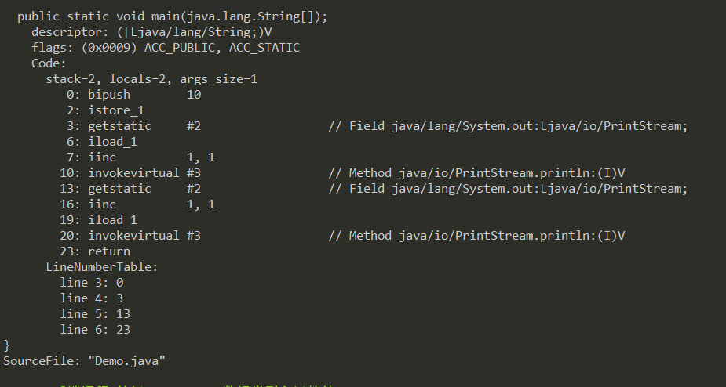
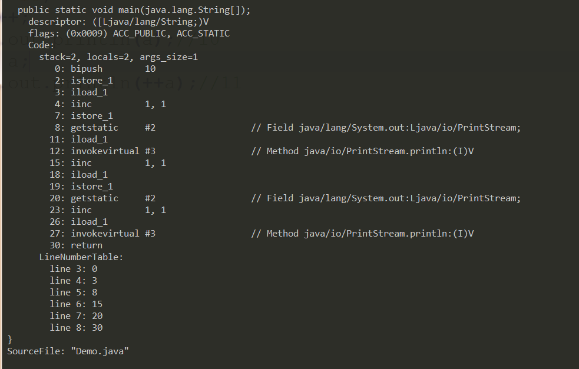
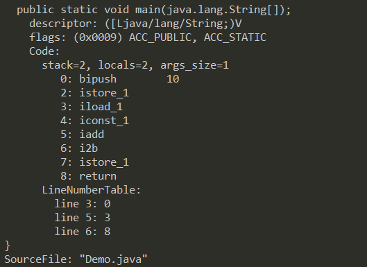

## 深入理解Java中特殊运算符
先看一段代码
```java
    public class Test{
        public static void main(String[] args){
            int a = 10;
            System.out.println(a++);//10
            System.out.println(++a);//12
        }
    }
```
上面的结果大家都清楚，一般的记忆规则：++在后面先用值，++在前面先进行加1在用值，但是具体内部是什么呢？下面通过Java字节码来看看为什么是这样。通过字节码就能发现，

System.out.println(a++);的结果为10，并不是因为先执行输出语句，后执行++操作，Java要执行函数调用必须通过操作数栈进行，前加，现在局部变量表中进行加1，在将值加载到操作数栈顶，而后加，是现将原来的值加载到操作数栈顶，再局部变量表中加1，所以就出现这种现象。如果明白了具体的情况，再遇到更难的题目也能解决，看下面一道题目。
```java
    public class Test{
        public static void main(String[] args){
            int a = 10;
            a = a ++;
            System.out.println(a);//10
            a = ++ a;
            System.out.println(++a);//11
        }
    }
```
如果能回答出上面的题目说明这块理解就比较深入了，先看a = a ++的操作。(1)先将局部变量表中的值加载到操作数栈(2)在局部变量中将a加1(3)将操作数栈顶的a重新load到局部变量表，所以值还为10。再来看看，a = ++ a的操作。(1)在局部变量表中将a 加1 (2)将a加载到操作数栈顶(3)将操作数栈顶的a重新load到局部变量表。所以a的值为11。

再看一段代码
```java
    public class Test{
        public static void main(String[] args){
            byte a = 10;
            a = a + 1;// Error
            a += 1;//通过
        }
    }
```
a = a + 1;操作是在操作数栈完成的，a + 1运算完成后整体变成int类型，完成后将a load到局部变量表的时候出现了问题，而为什么a += 1可以实现，操作是在局部变量表中完成的，并且Java编译器帮忙做了隐式转换i2b,将int型转成byte型，所以可以运行。
