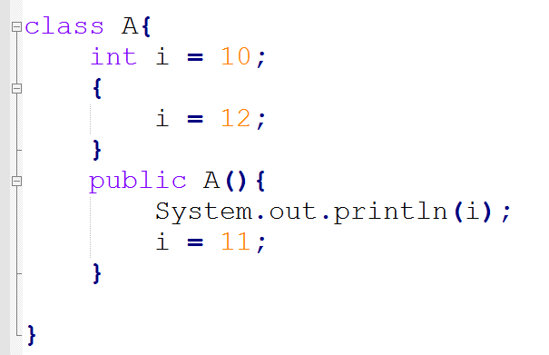
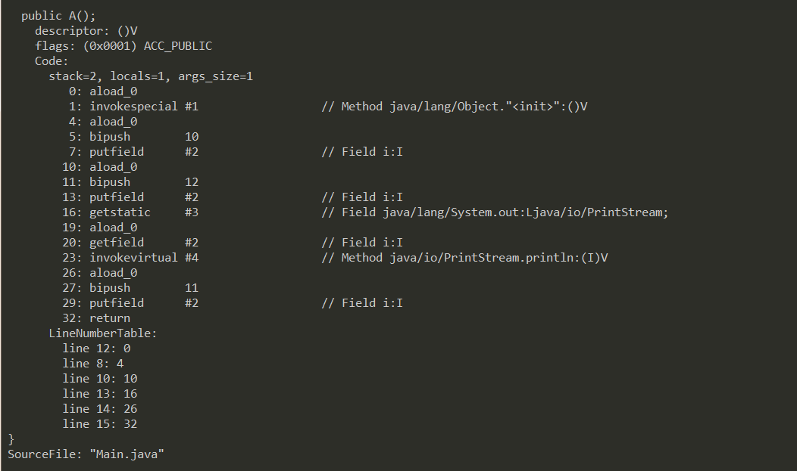

## 类的加载过程
- 加载：通过ClassLoader加载到内存
- 验证：验证魔数、JDK版本等
- 准备：将static修饰的变量，static代码块的变量设置成默认值。
- 解析：将符号引用变成直接地址引用
- 初始化：将static修饰的变量设置成初始化的值。
- 使用
- 销毁
#### 可以看出static修饰的变量已经代码块在类加载的时候就执行了，想要使用一个类首先得将该类的对象加载到内存也就是方法区。
## 创建对象时静态代码块、构造代码块、构造函数、显示初始化的执行顺序
#### 通过上面已经知道静态代码块肯定是先执行的，但是父类中包含子类的信息，肯定现将父类到子类的过程依次加载。
- 网络上的版本：
   
    - 首先执行父类静态的内容
    - 接着执行子类的静态的内容
    - 执行父类构造代码块
    - 执行父类的构造方法
    - 执行子类构造代码块
    - 执行子类的构造方法
- 上面的执行过程是对的，但是表达式存在问题的，其实在调用new关键字之后，JVM会开辟内存，将内存的引用压栈，复制一个引用然后再压栈，然后调用<init>方法也就是构造函数，本质上new一个对象之后调用<init>方法，在<init>方法中，JVM有默认的调用的过程。下面看字节码文件就很显然得出：
    - 调用父类的<init>
    - 执行显示初始化的变量
    - 执行构造代码块的内容
    - 执行写在构造函数中的内容

